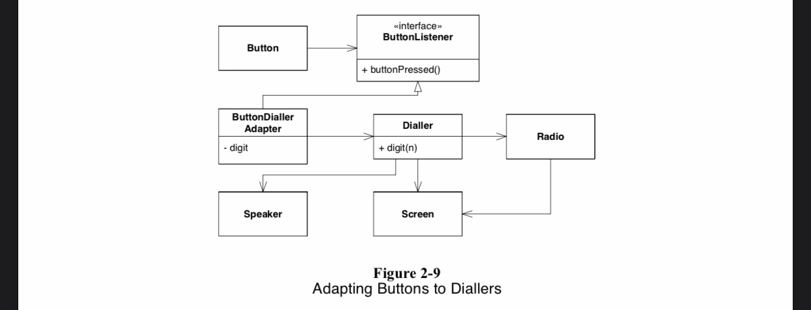
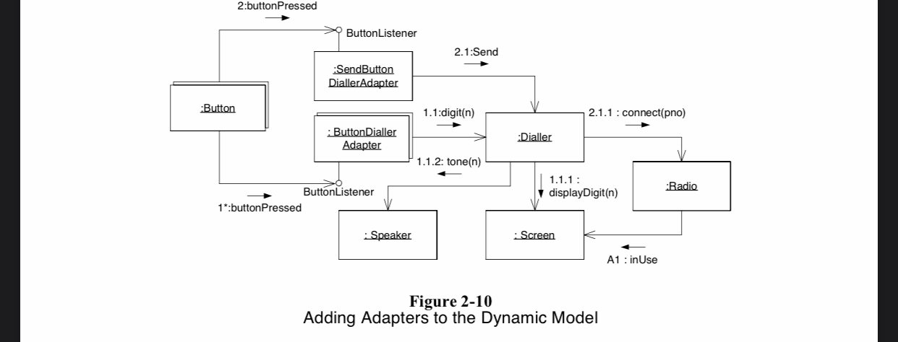

# Chapter 2

그림 2.9, 그림 2.10 Diagram을 Typescript 코드로 변환한 소스코드 

## 다이어그램으로 작업하기 (4/17)
### 왜 모델을 만들어야 하는가 ? 
실제로 설계가 잘 작동할지 알아보기 위해 -> 모델은 반드시 시험해 볼 수 있어야 한다 -> 가치를 평가할 수 없다면 가치가 없다
예) 건축가는 빌딩의 모델을 만들어서 건축주가 그 빌딩의 모습을 좋아할지 확인
예) 우리는 prototype, test로서 검증(?)

### 왜 소프트웨어 모델을 만드는가 ?
시험해 볼 구체적인 것이 있고, 그것을 코드로 시험해보는 것보다 UML로 시험해보는 쪽이 비용이 덜 들 때 UML을 사용한다
-> 비용이 적어야함
### UML을 효과적으로 사용하기
설계 개념에 대한 의견을 주고 받을 때 편리 (세부 구현을 소통하기에는 코드가 적합)
백엔드 문서. 우리가 원하는 것은 시스템의 핵심 내용을 짚어서 기술하는 핵심적인 다이어그램 몇 개. 과도한 다이어그램은 불필요.
동적 다이어그램 -> 정적 다이어그램 -> 동적 다이어그램 -> … (목적을 달성하기 위한 행위부터 시작하고 정적인 구조를 통해 설계를 개선 그리고 이를 순환)
꼭 필요한 경우가 아니라면 문서화하려고 하지 말고, 도구 쓰려고 하지 말고, 커뮤니케이션하고 다이어그램을 버려라! 
